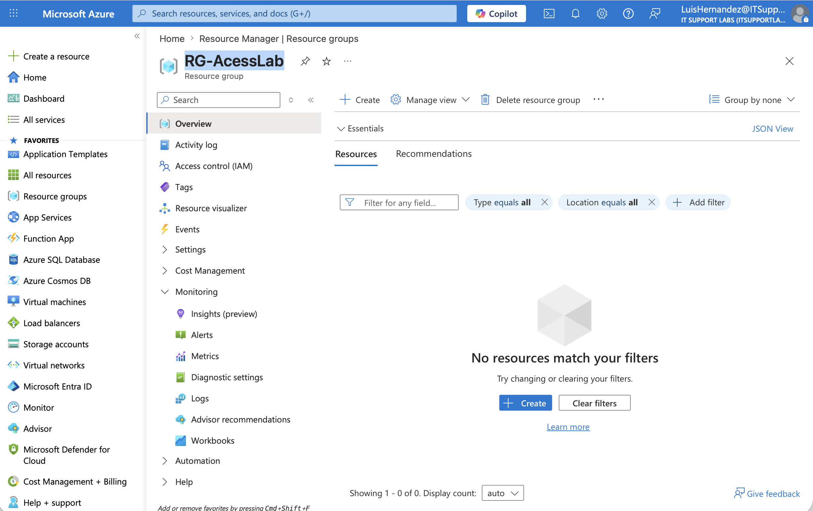
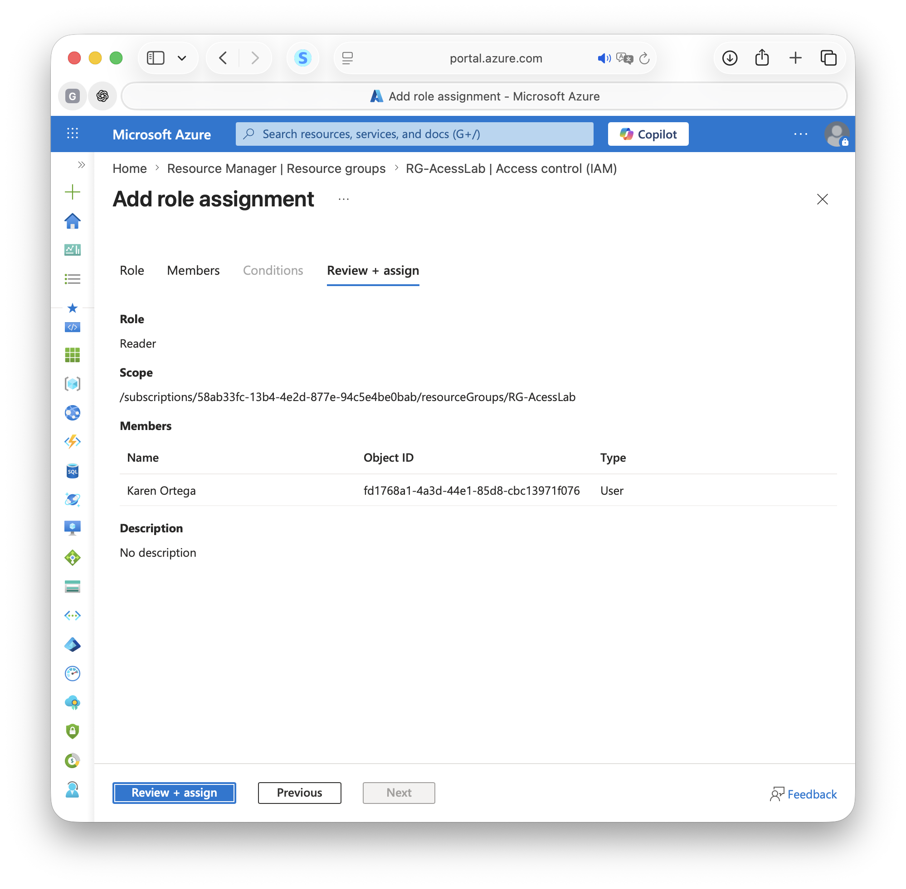
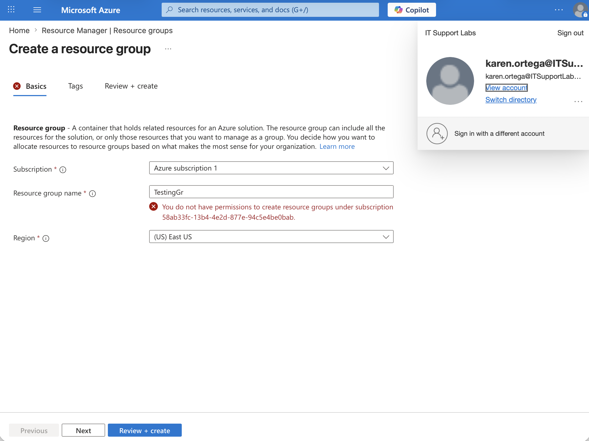
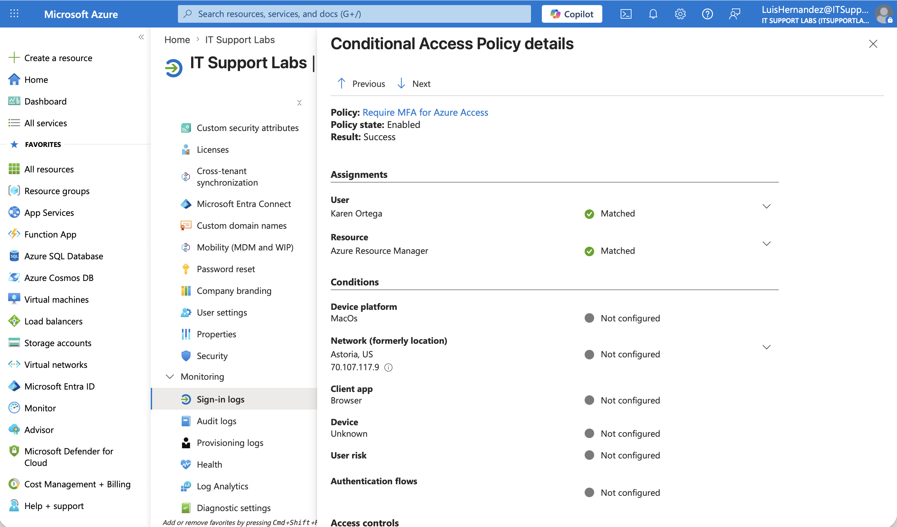

# Azure Identity + Access Control + Conditional Access Lab

## Objective 
Simulate secure access control in Azure by assigning least-privilege roles and enforcing Conditional Access (MFA) to protect cloud resources.

---

## Lab Environment 
- Microsoft Azure Portal
- Microsoft Entra ID

---

## Steps 

### 1. Created Azure Resource Group
Created a resource group titled `RG-AccessLab` in Microsoft Azure to serve as the scope for role-based access control (RBAC) testing.

---

### 2. Assigned RBAC Role at Resource Group Scope
Assigned the Reader role to a test user at the resource group level using Azure RBAC. This enforced least-privilege access, allowing read-only visibility without modification rights.

---

### 3. Validated Permission Restrictions
Logged in as the test user, Karen and attempted to create a new resource group. The action was denied, confirming RBAC restrictions were correctly enforced.

---

### 4. Implemented and Verified Conditional Access Policy (MFA)
Configured a Conditional Access policy requiring multi-factor authentication (MFA) for Azure access. Verified successful enforcement through Microsoft Entra sign-in logs, confirming the policy was applied during authentication.

![Screenshot 4](Screenshots/4-conditional-access-on.png

---

## Key Takeaways
- Implemented least-privilege access using Azure RBAC
- Demonstrated difference between authentication and authorization
- Enforced MFA using Conditional Access
- Validated security controls using sign-in logs
- Applied identity-based access control to secure Azure resources